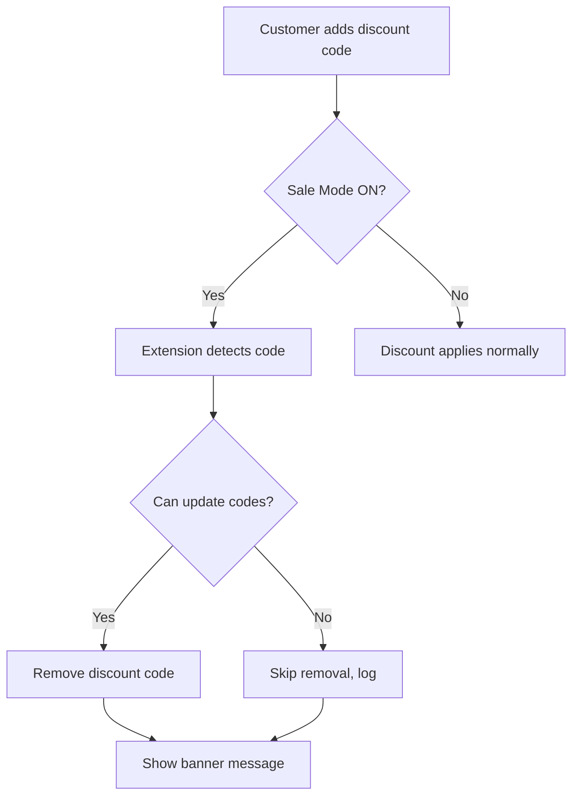

# Sale Discount Lock - Shopify Checkout UI Extension

A custom Shopify app that provides a Checkout UI Extension for managing discount code availability during sales. When Sale Mode is enabled, the extension automatically removes discount codes while keeping gift cards fully functional.

## Features

### ✅ Core Functionality
- **Automatic Discount Code Removal**: Removes any applied discount codes when Sale Mode is ON
- **Gift Card Preservation**: Never touches gift cards - they continue to work normally
- **Clear Messaging**: Shows configurable banner to inform customers
- **Easy Toggle**: Merchants control via Checkout Editor settings (no code deploy needed)

### 🛡️ Robust Error Handling
- Gracefully handles accelerated checkouts (Apple Pay, Google Pay)
- Checks `canUpdateDiscountCodes` instruction before attempting removal
- Catches and logs errors without breaking checkout experience
- Best-effort approach when permissions are restricted

## Installation

### Prerequisites
- Shopify Partner account
- Shopify CLI installed (`npm install -g @shopify/cli@latest`)
- A development store for testing

### Step 1: Clone and Install

```bash
cd sale-discount-lock
npm install
```

### Step 2: Connect to Your Partner App

```bash
shopify app link
```

Follow prompts to create or select an app in your Partner Dashboard.

### Step 3: Local Development

```bash
shopify app dev
```

This will:
1. Start a local development server
2. Generate a preview URL for testing
3. Allow you to test in a development store checkout

### Step 4: Test in Checkout

1. Add items to cart in your development store
2. Go to checkout
3. The extension will be visible in the Checkout Editor
4. Toggle "Enable Sale Mode" in the extension settings panel

### Step 5: Deploy

When ready for production:

```bash
shopify app deploy
```

Then install the app on your store through the Partner Dashboard.

## Configuration

### Extension Settings

Merchants configure the extension in the Checkout Editor with these settings:

| Setting | Type | Description | Default |
|---------|------|-------------|---------|
| **Enable Sale Mode** | Boolean | Toggles discount code blocking ON/OFF | `false` |
| **Sale banner message** | Text | Custom message shown to customers | "Sitewide sale is active — discount codes are disabled. Gift cards still apply." |

### Extension Targets

The extension uses two targets for maximum flexibility:

1. **`purchase.checkout.block.render`**: Merchants can place the banner anywhere in checkout via the Checkout Editor
2. **`purchase.checkout.reductions.render-after`**: Automatically shows after the discount/gift card form in the order summary

## How It Works

### When Sale Mode is ON:



### When Sale Mode is OFF:
- Extension does nothing
- All discount codes work normally
- Banner is hidden

### Gift Cards:
- **ALWAYS work** regardless of Sale Mode
- Extension never calls `applyGiftCardChange`

## Technical Details

### Architecture

- **Framework**: Preact (included with `@shopify/ui-extensions`)
- **API Version**: 2025-10
- **Components**: Polaris Checkout UI web components (`<s-banner>`, `<s-text>`)
- **State Management**: Global `shopify` object signals (`.value` property, `.subscribe()` method)

### Key Implementation Notes

#### 2025-10 API Patterns
The extension uses the latest Checkout UI Extensions patterns:

```javascript
// Settings access (no useApi() needed)
const settings = shopify.settings.value;

// Discount codes subscription
shopify.discountCodes.subscribe((codes) => {
  // React to changes
});

// Remove discount code
await shopify.applyDiscountCodeChange({
  type: "removeDiscountCode",
  code: discountCode.code
});
```

#### Error Handling

```javascript
// Always check instructions first
if (!shopify.instructions.value?.discounts?.canUpdateDiscountCodes) {
  return; // Cannot update, skip gracefully
}

// Catch errors for accelerated checkout scenarios
try {
  await shopify.applyDiscountCodeChange({ ... });
} catch (e) {
  console.log('Skipped:', e); // Log but don't break
}
```

## Limitations & Considerations

### Platform Limitations
1. **Cannot hide the discount/gift card field**: Checkout UI Extensions cannot remove core checkout UI elements
2. **Accelerated checkouts**: `applyDiscountCodeChange` may not work in Apple Pay, Google Pay, Shop Pay flows
3. **Best-effort removal**: Extension attempts removal but cannot guarantee it in all scenarios

### Recommended Best Practices
For complete enforcement, merchants should also:
1. Configure discount combinability rules in Shopify Admin
2. Set up automatic discounts vs code discount rules
3. Use this extension as an additional layer of protection

### Security Considerations
- Extension runs client-side in checkout
- Uses Shopify's standard API methods
- No external network calls needed
- No sensitive data handling

## Troubleshooting

### Discount codes aren't being removed
**Check:**
- Is Sale Mode enabled in Checkout Editor settings?
- Are you testing with a regular checkout (not Apple Pay/Google Pay)?
- Check browser console for error logs

### Banner not showing
**Check:**
- Is Sale Mode enabled?
- Is the extension activated in the Checkout Editor?
- Try placing the block target in a visible location

### Development store issues
**Check:**
- Is your store in development mode?
- Have you saved the extension in the Checkout Editor?
- Try `shopify app dev --reset` to clear cache

## Support

For issues related to:
- **Shopify CLI**: See [Shopify CLI documentation](https://shopify.dev/docs/apps/tools/cli)
- **Checkout UI Extensions**: See [Checkout UI Extensions reference](https://shopify.dev/docs/api/checkout-ui-extensions)
- **This app**: Open an issue in the repository

## License

MIT License - See LICENSE file for details

## Credits

Built with:
- [Shopify Checkout UI Extensions](https://shopify.dev/docs/api/checkout-ui-extensions)
- [Polaris Design System](https://polaris.shopify.com/)
- Following [Shopify's UI/UX best practices](https://shopify.dev/docs/apps/checkout/best-practices)

